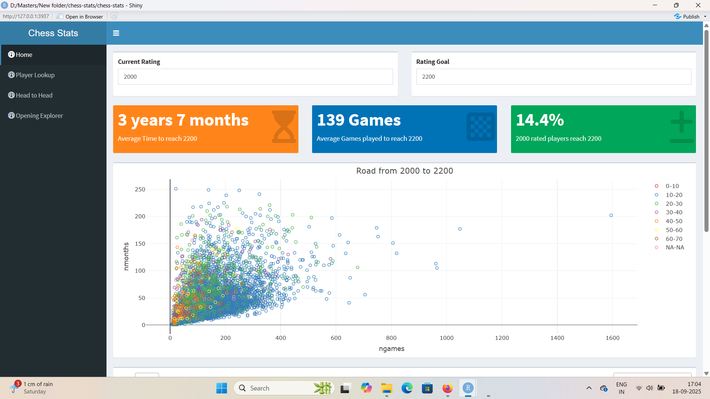
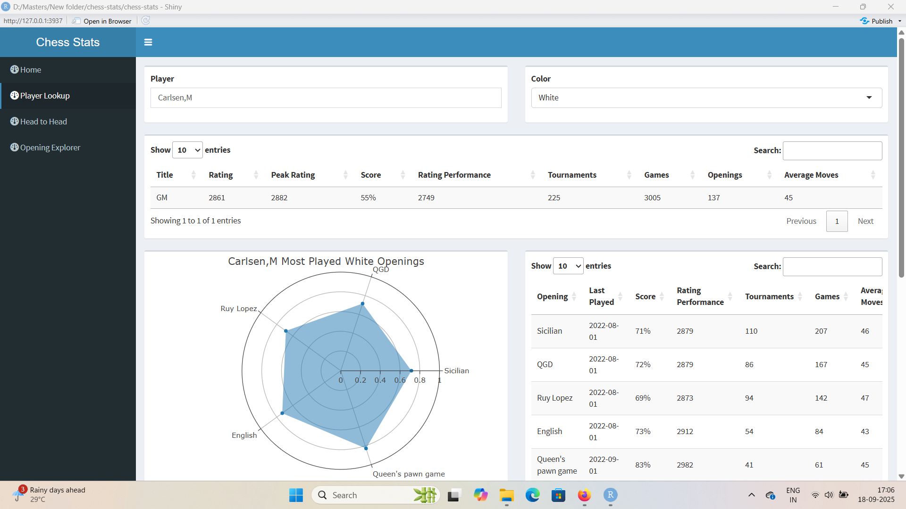

# Chess Stats Dashboard ♟️

An interactive **Shiny dashboard** built in R that visualizes FIDE chess statistics, player performance, and rating progress.

---

## 🚀 How to Run

1. **Clone this repository:**
   ```bash
   git clone https://github.com/meetb02/chess-stats.git
   cd chess-stats

Open R or RStudio in the project folder.
Install the required packages (only once):
install.packages(c("shiny", "shinydashboard", "tidyverse", "DT", "plotly",
                   "reshape2", "ggplot2", "lubridate", "fst", "formattable",
                   "dqshiny", "purrr", "remotes"))
remotes::install_github("jbkunst/rchess") # optional
Run the app:
shiny::runApp("app.R")
✅ A browser window will open with the dashboard 🎉

## 📊 Features
- **Home**: “Road to XXXX” analysis (time & games needed to reach target rating)  
- **Player Lookup**: Ratings, peak performance, openings, tournaments  
- **Head-to-Head**: Compare two players across score, games, and rating ranges  
- **Opening Explorer**: Analyze most common openings and success rates  

---

## 📂 Project Structure
- `app.R` — main Shiny app code  
- `helpers.R` — helper functions  
- `R_Data/` — chess datasets (`.fst` / `.rds`)  

## 🖼️ Screenshots

### Home Dashboard


### Player Lookup


